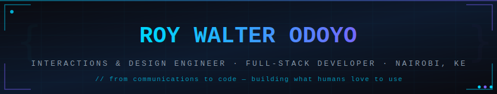

<div align="center">



<br/>

[](https://github.com/2early4coffee?tab=followers)
[](https://2early4coffee.github.io)
[](https://linkedin.com/in/YOUR_LINKEDIN)

</div>

---

<table>
<tr>
<td width="230" valign="top" align="center">

<br/>

```
  ╔════════════════╗
  ║  2early4coffee ║
  ╚════════════════╝
```

**Roy Walter Odoyo**
`@2early4coffee`

📍 Nairobi, Kenya
🕐 GMT+3

*comms → design → code*

</td>
<td valign="top">

```console
$ whoami
                           walter@nairobi
    ┌─────────────┐        ──────────────────────────────────────────
    │  ( ◕  ◕ )  │        Role     : Interactions & Design Engineer
    │  ╰──────╯  │        Day job  : Digital Comms & Marketing @ OPPEIN Kenya
    │   ╱ ☕  ╲  │        Building : MediCare — healthcare platform for Kenya
    │  ╱________╲│        Stack    : React · Node.js · MongoDB · Express
    └─────────────┘        Also     : Angular · Python · C · Unity/C#
                           Design   : Figma · p5.js · Creative Coding
                           Learning : CS50x · System Design · HCI
                           Uptime   : 6 yrs comms, ~3 yrs shipping code
                           Motto    : Build what humans love to use.
```

</td>
</tr>
</table>

---

```console
$ cat ~/stack.md

Shipping now     React · Preact · Node.js · Express · MongoDB · Clerk · Stripe
Also reach for   Angular · TypeScript · TailwindCSS · Vite
Creative layer   Figma · p5.js · SVG animation · Unity · C#
Low-level roots  C · Python · Django
Exploring        WebXR · Gesture interfaces · Drone tech in East Africa

# My background in PR and digital communications isn't a detour.
# It's why I think about interfaces the way I do — every pixel
# is a message. Every interaction is a conversation.
```

---

## 🔭 Start Here

```console
$ ls -1 ~/projects
medicare/           # full-stack healthcare appointment platform
angular-shop/       # e-commerce SPA — Angular v22 + TypeScript
portfolio-site/     # 2early4coffee.github.io
cs50x-work/         # harvard cs50 problem sets — C, Python, SQL
```

| Project | What it is | |
|---------|-----------|---|
| **MediCare** | A healthcare appointment platform built for the Kenyan market. React/Preact frontend, admin panel, Node.js/Express API, MongoDB Atlas, Clerk auth, Stripe payments, Cloudinary. | [](https://github.com/2early4coffee/medicare) |
| **Angular E-Commerce** | Hands-on Angular deep-dive — full SPA with routing, reactive forms, state management, TypeScript-first. | [](https://github.com/2early4coffee/angular-shop) |
| **Portfolio** | Hand-built, deployed on GitHub Pages. The one place everything connects. | [](https://2early4coffee.github.io) |

---

## 📊 Stats

<div align="center">

<picture>
  <source media="(prefers-color-scheme: light)" srcset="https://github-readme-stats.vercel.app/api?username=2early4coffee&show_icons=true&bg_color=ffffff&title_color=0d1117&icon_color=00d4ff&text_color=24292f&border_color=e1e4e8&count_private=true"/>
  <source media="(prefers-color-scheme: dark)" srcset="https://github-readme-stats.vercel.app/api?username=2early4coffee&show_icons=true&bg_color=0d1117&title_color=00d4ff&icon_color=7b61ff&text_color=ffffff&border_color=30363d&count_private=true"/>
  
</picture>

<picture>
  <source media="(prefers-color-scheme: light)" srcset="https://github-readme-stats.vercel.app/api/top-langs/?username=2early4coffee&layout=compact&bg_color=ffffff&title_color=0d1117&text_color=24292f&border_color=e1e4e8&langs_count=8"/>
  <source media="(prefers-color-scheme: dark)" srcset="https://github-readme-stats.vercel.app/api/top-langs/?username=2early4coffee&layout=compact&bg_color=0d1117&title_color=00d4ff&text_color=ffffff&border_color=30363d&langs_count=8"/>
  
</picture>

</div>

<div align="center">

<picture>
  <source media="(prefers-color-scheme: light)" srcset="https://github-readme-activity-graph.vercel.app/graph?username=2early4coffee&bg_color=ffffff&color=24292f&line=00d4ff&point=7b61ff&area=true&area_color=00d4ff&title_color=24292f&hide_border=true&radius=12&custom_title=Build%20what%20humans%20love%20to%20use."/>
  <source media="(prefers-color-scheme: dark)" srcset="https://github-readme-activity-graph.vercel.app/graph?username=2early4coffee&bg_color=0d1117&color=8899aa&line=00d4ff&point=7b61ff&area=true&area_color=00d4ff&title_color=ffffff&hide_border=true&radius=12&custom_title=Build%20what%20humans%20love%20to%20use."/>
  
</picture>

</div>

---

## 🧭 The Arc

```console
$ systemctl status 2early4coffee
● 2early4coffee.service — Build what humans love to use.
     Loaded: loaded (/home/walter/career.service; enabled)
     Active: active (running) since 2018
   Main PID: 1 (communications)
     Status: "Shipping MediCare. Learning Angular. Applying to grad school."

     ├─ communications.service      6 yrs PR, digital marketing, content strategy
     │   └─ oppein-kenya.service    Digital Comms & Marketing Manager (2021–present)
     │
     ├─ design.service              Graphic design diploma · Figma · brand systems
     │
     └─ engineering.service         MERN stack · Angular · CS50x · creative coding
         └─ target.service          Interactions & Design Engineer
                                    Keio University KMD — target: Sept 2027

$ journalctl -u 2early4coffee --since 2024 --grep=shipped
2024  Django todo app          deployed to GitHub Pages
2024  MediCare v0.1            first working appointment flow
2025  MediCare admin panel     stats dashboard + Kenyan doctor data seeded
2025  Portfolio site           live at 2early4coffee.github.io
2026  Angular e-commerce SPA   in progress
```

---

## 🔗 Connect

```console
$ curl -s https://api.github.com/users/2early4coffee | jq '{bio, location}'
{
  "bio": "Interactions & Design Engineer in the making. MERN · Angular · Figma · CS50x 🇰🇪",
  "location": "Nairobi, Kenya"
}
```

<div align="center">

[](https://2early4coffee.github.io)
[](https://linkedin.com/in/YOUR_LINKEDIN)
[](mailto:YOUR_EMAIL)

<br/>

### Build what humans love to use.

*From mass communications to machine instructions — the throughline is people.*

<br/>


</div>
