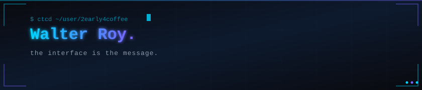

<div align="center">



<br/>

[](https://github.com/2early4coffee?tab=followers)
[](https://2early4coffee.github.io)
[](https://twitter.com/2early4coffee)

</div>

---

<table>
<tr>
<td width="220" valign="top" align="center">

<br/>

```
  ╔════════════════╗
  ║  2early4coffee ║
  ╚════════════════╝
```

**Walter Roy**
`@2early4coffee`

*comms → design → code*

</td>
<td valign="top">

```json
// $ ctcd ~/user/2early4coffee/who_is_he

{
  "who_is_he": {
    "role": [
      "full-stack engineer in training",
      "ui/ux designer",
      "occasional game dev"
    ],
    "languages": ["JavaScript", "Python", "C#"],
    "comfortable_with": {
      "backend": ["Node.js", "Express.js"],
      "frontend": ["HTML5", "CSS3"],
      "databases": ["MongoDB", "MySQL", "PostgreSQL"],
      "tools": ["Git", "Figma", "Postman", "Docker (foundational)"]
    },
    "uptime": "May 2026 — actively coding & learning",
    "philosophy": {
      "every_days_plan": [
        "try a little",
        "try not to breakdown even a little",
        "& win a little 😊"
      ]
    }
  }
}
```

</td>
</tr>
</table>

---

```json
// $ ctcd ~/user/2early4coffee/stack/what_am_i_learning

{
  "what_am_i_learning": {
    "currently": ["React", "Angular", "Django", "Java (Spring Boot)", "DSA"],
    "next_up": ["Go", "Three.js", "Cloud (AWS)", "TypeScript"],
    "looking_ahead": ["C++", "C", "Kubernetes"],
    "reading": [
      "Express in Action — Evan M. Hahn",
      "Docker Deep Dive — Nigel Poulton"
    ],
    "also_learning": "日本語 (Japanese)"
  }
}
```

---

```json
// $ ctcd ~/about_me

{
  "about_me": {
    "status": "deliberate shift into tech",
    "approach": "curiosity-driven learning",
    "currently": [
      "learning to code",
      "understanding how systems are built",
      "solving problems"
    ],
    "goal": "teach what I've learned to others one day",
    "career_path": "not entirely sure yet",
    "interests": ["spatial engineering", "interactive tech"],
    "open_to": [
      "junior roles",
      "collaboration",
      "volunteer opportunities",
      "mentorship",
      "job shadowing with experienced devs",
      "peer-to-peer collabs"
    ]
  }
}
```

---

## 📊 Stats

<div align="center">

<picture>
  <source media="(prefers-color-scheme: light)" srcset="https://github-readme-stats.vercel.app/api?username=2early4coffee&show_icons=true&bg_color=ffffff&title_color=0d1117&icon_color=00d4ff&text_color=24292f&border_color=e1e4e8&count_private=true"/>
  <source media="(prefers-color-scheme: dark)" srcset="https://github-readme-stats.vercel.app/api?username=2early4coffee&show_icons=true&bg_color=0d1117&title_color=00d4ff&icon_color=7b61ff&text_color=ffffff&border_color=30363d&count_private=true"/>
  
</picture>

</div>

<div align="center">

<picture>
  <source media="(prefers-color-scheme: light)" srcset="https://github-readme-stats.vercel.app/api/top-langs/?username=2early4coffee&layout=donut&bg_color=ffffff&title_color=0d1117&text_color=24292f&border_color=e1e4e8&langs_count=8&hide_border=false"/>
  <source media="(prefers-color-scheme: dark)" srcset="https://github-readme-stats.vercel.app/api/top-langs/?username=2early4coffee&layout=donut&bg_color=0d1117&title_color=00d4ff&text_color=ffffff&border_color=30363d&langs_count=8&hide_border=false"/>
  
</picture>

</div>

---

## 📈 Activity

<div align="center">

<picture>
  <source media="(prefers-color-scheme: light)" srcset="https://github-readme-activity-graph.vercel.app/graph?username=2early4coffee&bg_color=ffffff&color=24292f&line=00d4ff&point=7b61ff&area=true&area_color=00d4ff&title_color=24292f&hide_border=true&radius=12&custom_title=the%20interface%20is%20the%20message."/>
  <source media="(prefers-color-scheme: dark)" srcset="https://github-readme-activity-graph.vercel.app/graph?username=2early4coffee&bg_color=0d1117&color=8899aa&line=00d4ff&point=7b61ff&area=true&area_color=00d4ff&title_color=ffffff&hide_border=true&radius=12&custom_title=the%20interface%20is%20the%20message."/>
  
</picture>

</div>

---

```json
// $ ctcd ~/user/2early4coffee/beyond_code

{
  "beyond_code": {
    "outdoors": "kinda hike sometimes",
    "on_break_from": "running and endurance sports (figuring out life first)",
    "gaming": "when I get the chance",
    "alternate_universe": "spaceship cargo pilot",
    "culture": "enjoy attending the orchestra 😊"
  }
}
```

---

```json
// $ connect --user 2early4coffee

{
  "connect": {
    "twitter": "@2early4coffee → https://twitter.com/2early4coffee",
    "email": "walteniumroy@gmail.com",
    "portfolio": "https://2early4coffee.github.io"
  }
}
```

<div align="center">

<br/>

[](https://twitter.com/2early4coffee)
[](mailto:walteniumroy@gmail.com)
[](https://2early4coffee.github.io)

<br/>

*writing code, building things, figuring it out.*

<br/>


</div>
